## e_commerce_application 
# Description : 
The e-commerce application provides a seamless online shopping experience, offering a range of user-friendly features. It includes a secure Login and Signup system, allowing users to create and manage their accounts effortlessly. The Product Page displays a variety of items with detailed descriptions, prices, and images, enabling users to browse and select products easily.

The Cart Page lets users review their selected items, update quantities, or remove products before proceeding to checkout. A streamlined Payment Page ensures secure transactions, supporting payment methods for convenience. After successful payment, users are directed to a Thanks Page, where they can confirm their order and express gratitude for their purchase.

Designed with responsive functionality, the platform adapts to mobile, tablet, and desktop devices, ensuring an optimal user experience across all screen sizes. Whether you're a first-time visitor or a returning customer, this application provides an efficient, secure, and enjoyable shopping journey.

# Tech Stack :
1. HTML5
2. CSS3
3. Vanilla Js
4. Local Storage

# Tools :
1. Git & GitHub
2. VsCode
3. Vercel

# Web Site Link : 
https://ecommerceapplication-lake.vercel.app/

## Web Site Pages :
# Sign Up Page : 
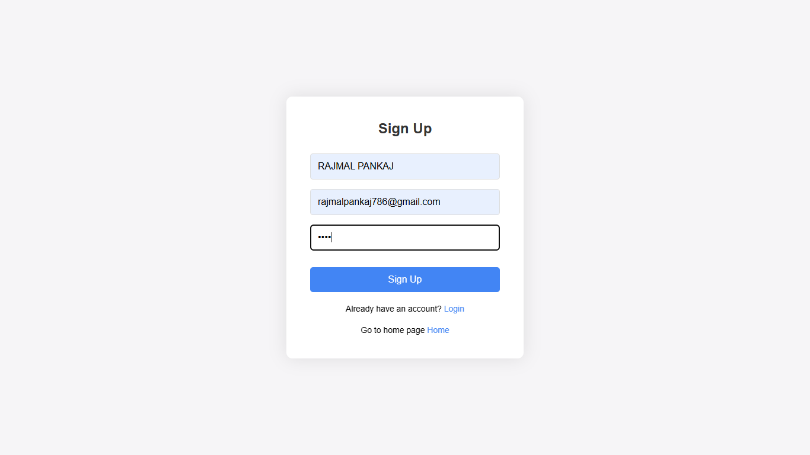 

# LogIn Page : 

# Home Page : 
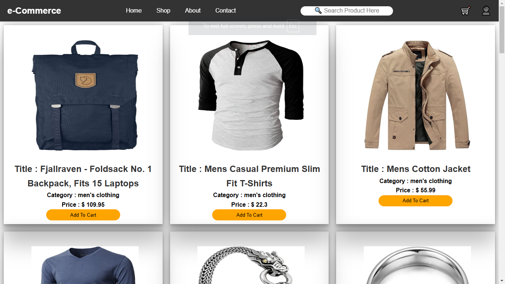

# Product Details Page : 
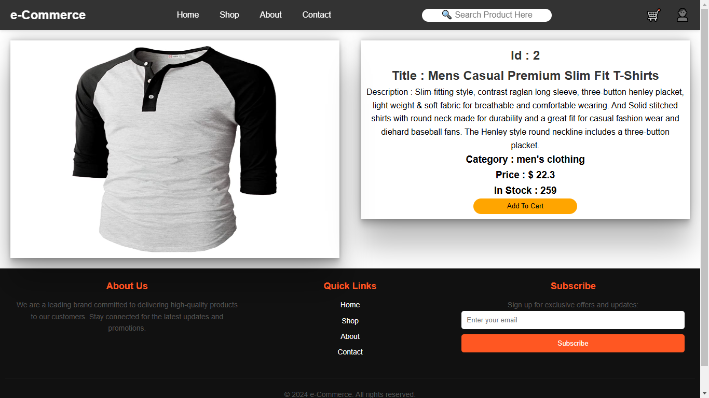

# About Page : 
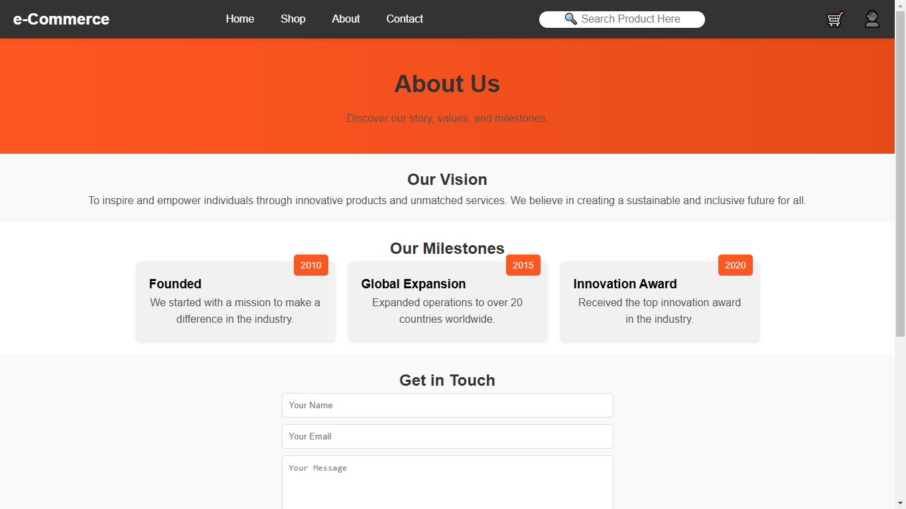

# Contact Page : 
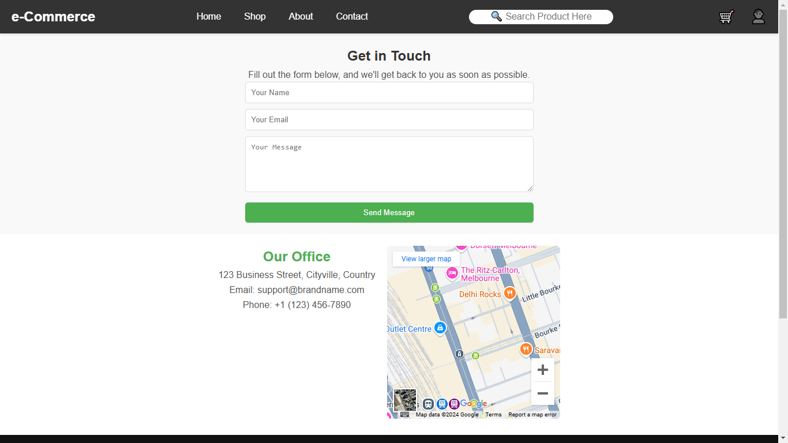

# Search Method : 
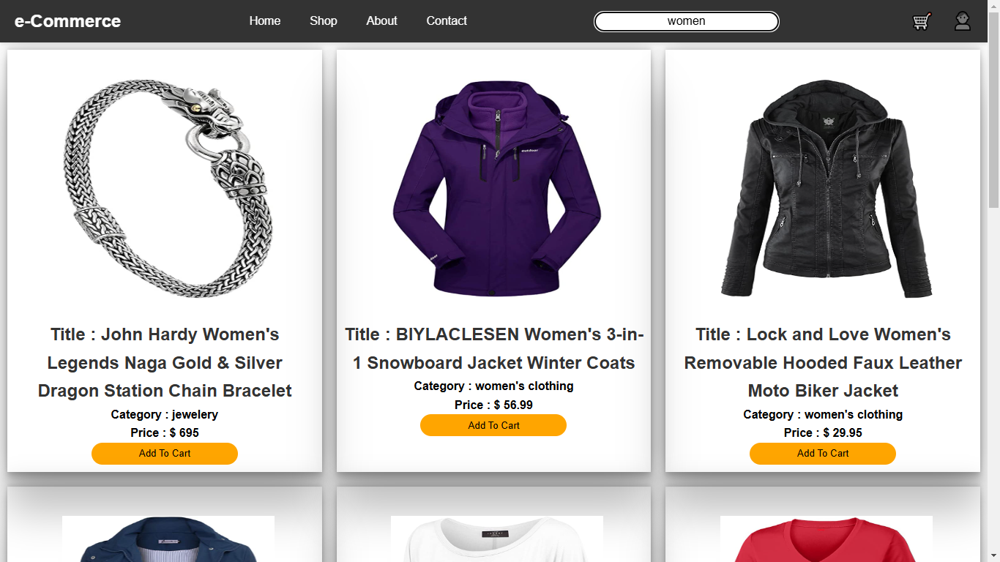

# Cart Page : 
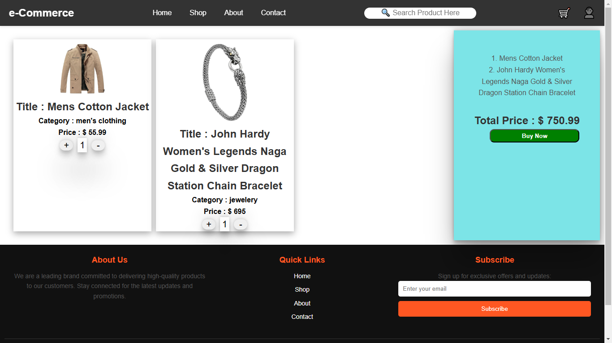

# Payment Page : 
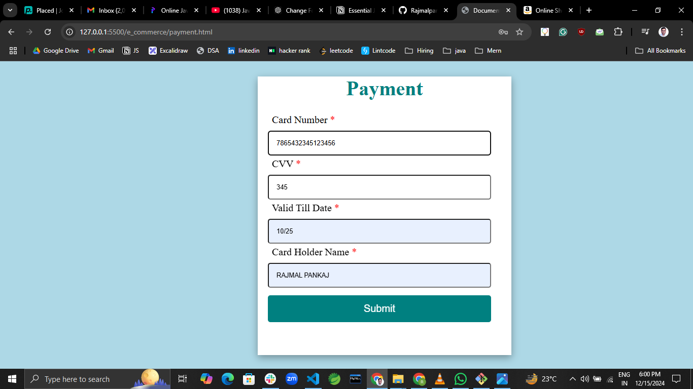

# OTP Page : 
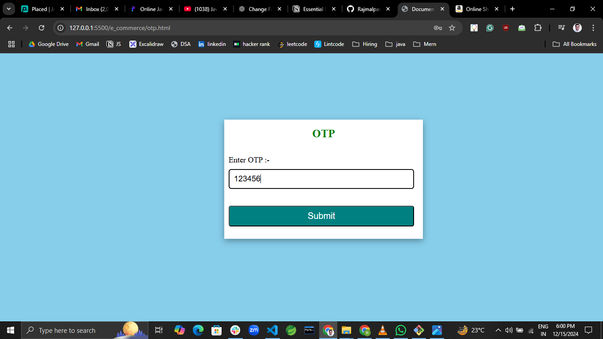

# Thanks Page : 
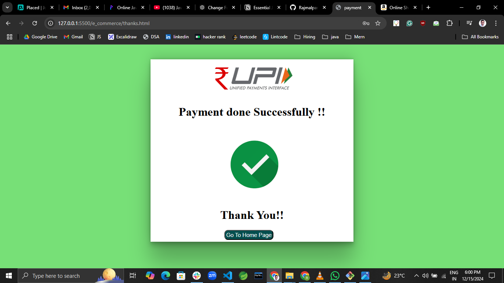

# Order Page : 
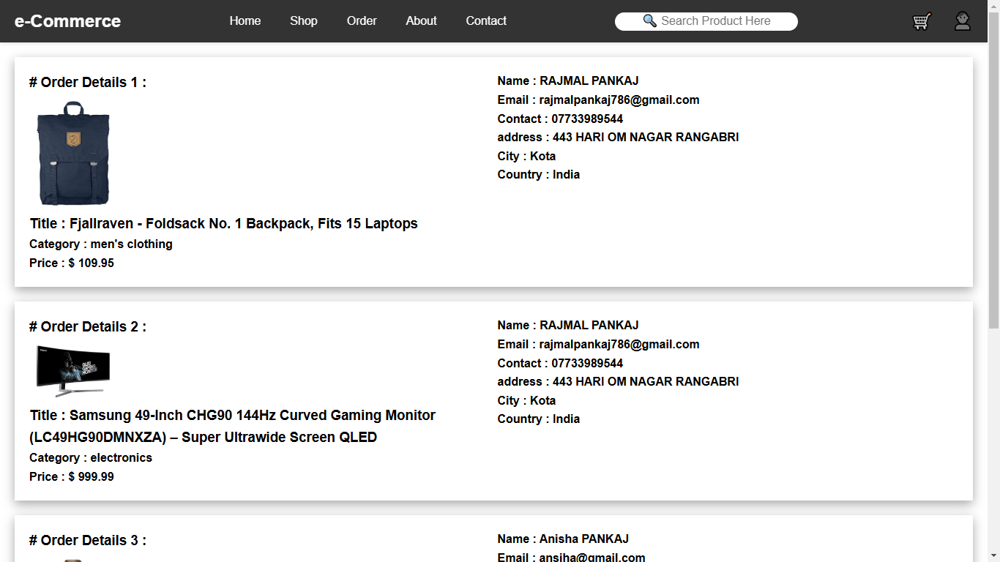
